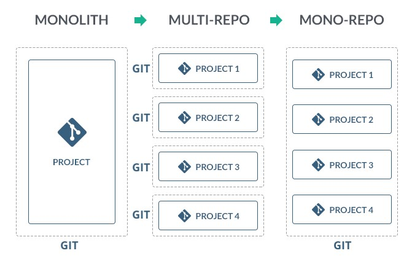

# Monorepo

## Monorepo 란?

---

두 개 이상 프로젝트(모듈)를 하나의 레퍼지토리에서 관리하는 방법이고 공통으로 쓰는 패키지들을 공유해서 관리할 수 있는 방법



### 장점

---

- **코드의 재사용:** 여러 레퍼지토리에서 프로젝트를 진행하면 비슷한 로직을 각 레퍼지토리에서 중복 구현하는 때가 많습니다. 이런 공통 로직을 다시 작성하지 않고 공통 로직을 쉽게 공유할 수 있습니다.
- **의존성 관리:** 기존의 멀티레포 구조에서는 각 레퍼지토리에 prettier, tslint 등 설정에 필요한 외부 라이브러리를 를 각각 설치해야 했습니다. 하지만 모노레포에서는 각 레퍼지토리를 Cloning하고 일일이 업데이트하는 과정을 거치지 않고 공통 모든 모듈에서 사용되는 외부 라이브러리를 공유할 수 있습니다.
- **단일 책임 원칙**: 여러 레포에서 변경사항이 있다면 개발자는 작은 커밋으로 나눠 PR(Pull Request)을 보내는 것보다, 모든 코드를 작성하고 이에 대한 의존성을 바꾸는 방식의 작업을 선호합니다. 하지만 모노레포에서는 여러 패키지의 변경사항을 하나의 커밋과 PR로 제출할 수 있습니다. 덕분에 더 작게 나눠서 작업할 수 있죠. 다만 **하나의 커밋에는 한 패키지의 변경사항만 기록하는 SRP(Single Responsibility Principle, 단일 책임 원칙)**를 지켜야 합니다.
- **협업:** 모든 구성원이 모든 코드에 접근하기 쉽기 때문에 협업에 용이 합니다

- lerna : 각 패키지들을 배포하고 버전 관리하는 역할
- yarn workspace : 각 패키지간의 의존성 관리를 하는 역할

## **Lerna**

---

- Lerna는 git 및 npm을 사용하여 다중 패키지 리포지토리를 관리하는 작업 과정을 최적화하는 도구입니다.

```json
// lerna 설치
yarn global add lerna

// root project lerna 초기화
lerna init

// root package.json workspaces 설정
{
	"workspaces": [
    "packages/*"
  ]
}
// root lerna.json
{
  "packages": ["packages/*"],
  "version": "0.0.0", // 패키지 버전 공통 관리시 버전 명시, 개별 관리시 "independent"
  "npmClient": "yarn", // npm 대신 yarn 사용시
  "useWorkspaces": true // yarn workspaces 사용을 위한 설정
}

// command
// 패키지 node_modules 제거 (-y option (accept all))
lerna clean -y

// publish, 각 패키지별 버전 설정 및 배포 (package.json 버전 변경, 배포 태그 생성)
lerna publish

```

[Lerna · A tool for managing JavaScript projects with multiple packages.](https://lerna.js.org/)

[https://github.com/lerna/lerna](https://github.com/lerna/lerna)

## Yarn Workspaes

---

- 각 패키지 간의 의존성 관리 (lerna 로도 가능하지만 일부 문제가 있어서 의존성 관리는 yarn 으로 하는걸 추천
- babel은 lerna를 버리고 yarn workspaces 만 사용중
- lerna도 yarn workspaces 를 사용중

```json
// root/package.json
{
	"name": "root package name",
	"private": true, // root 프로젝트가 NPM Repository로 배포되는 것을 금지
	"workspaces": [ // workspace에 추가될 패키지를 지정, lerna.json의 packages 경로와 일치
		"packages/*"
	],
	"devDependencies": {
		"lerna": "^4.0.0"
	}
}

// yarn workspaces 설치
yarn install

// yarn 공통 패키지 설치
yarn add [install package] -W (or --ignore-workspace-root-check)

// yarn 특정 패키지에만 설치시
yarn workspaces [packages] add [install package] --dev
```

[Yarn](https://classic.yarnpkg.com/lang/en/docs/workspaces/)

## 참고

---

[Monorepos: Yarn Workspaces and Lerna for beginners!](https://www.youtube.com/watch?v=hNJROosGexA)

[https://github.com/babel/babel](https://github.com/babel/babel)

[https://github.com/storybookjs/storybook](https://github.com/storybookjs/storybook)
